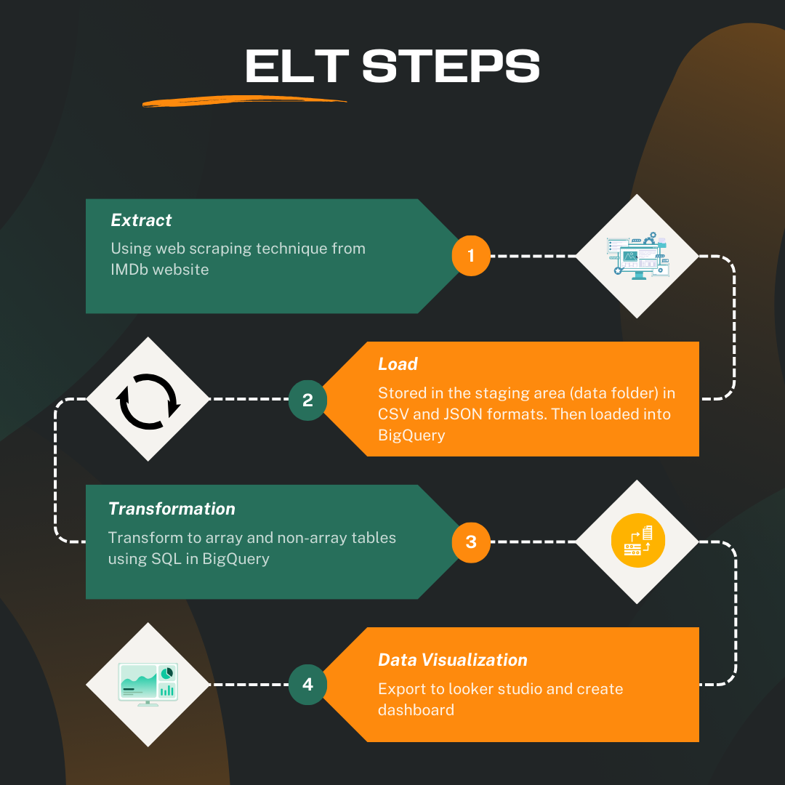
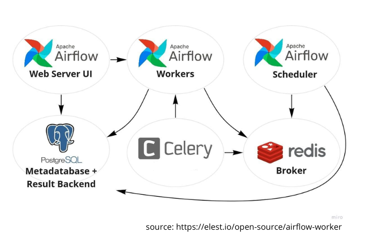

# ELT Project: IMDb Web Scraping to BigQuery and Looker Studio Dashboard

This project implements an EL (extract and load) pipeline to scrape data from the IMDb website, load it into Google BigQuery. And then, transform the data using SQL, and visualize the results in Looker Studio.

## Workflow Overview



### ELT Steps:
1. **Extract**:
   - Web scraping techniques using selenium, I am extract data from the IMDb website.
   - The data contains information related to top movies, such as title, year, rating, and more.

2. **Load**:
   - The extracted data is temporarily stored in the **staging area** (data folder) in both CSV and JSON formats.
   - The data is then loaded into **Google BigQuery** for further processing.
   - Result:
   

3. **Transformation**:
   - The data is transformed in BigQuery using SQL queries.
   - This includes converting the data into array and non-array tables as required for visualization.
  
<p align="center">
  
  
</p>

<p align="center">
  
  
</p>

4. **Data Visualization**:
   - Once the data is processed and transformed, it is exported to **Looker Studio**.
   - A dashboard is created to visualize the data.

## Prerequisites

Before running the project, ensure that you have the following installed:

- Docker
- Docker Compose
- Google Cloud Credential
- Python 3.10
- Apache Airflow 2.10.2

### Google Cloud Setup

1. Create a **BigQuery dataset** and tables to store the scraped data.
2. Set up **Google Cloud service account credentials** for authentication, and make sure the environment variable `GOOGLE_APPLICATION_CREDENTIALS` is set in your `.docker-compose` file and `Dockerfile`.

### Airflow Setup

1. Use the provided `Dockerfile` and `docker-compose.yml` to set up Airflow inside a Docker environment.
2. The Airflow DAG is defined in `dags/scrape_dag.py`, which automates the web scraping and loading.

## Running the Project

### Step 1: Clone the Repository

```bash
git clone hhttps://github.com/BeamiMW/ELT.git
cd ELT
```

### Step 2: Set Up the Environment
1. Set up the `docker-compose` and `Dockerfile` file with your Google Cloud credentials and .env with other necessary configurations.
2. Build and run the Docker containers:
```bash
docker-compose up --build
```
3. Access the Airflow web UI at http://localhost:8080 and trigger the DAG to start the EL process.

### Step 3: Monitor the Workflow
1. You can monitor the progress of each step (Extract and Load) in the Airflow UI.
2. If any errors occur, check the task logs in Airflow for troubleshooting.

### Step 4: Transform the Data
1. You can transform data in BigQuery using SQL queries
2. Select the columns needed for the visualization process

### Step 5: Visualize the Data
1. Once the data has been loaded and transformed in BigQuery, it can be visualized using Looker Studio.
2. The data can be exported from BigQuery and linked to Looker Studio to create dashboard for visualization.

## Dashboard

You can view the final data visualization in the Looker Studio dashboard here:

[View Dashboard](https://lookerstudio.google.com/reporting/b458f6c0-c77b-45f8-ae3d-dde9462570b7)

## Pipeline


## Architecture


## Future Improvement
1. Using IMDb API
2. Transformation and data cleaning in the pipeline
